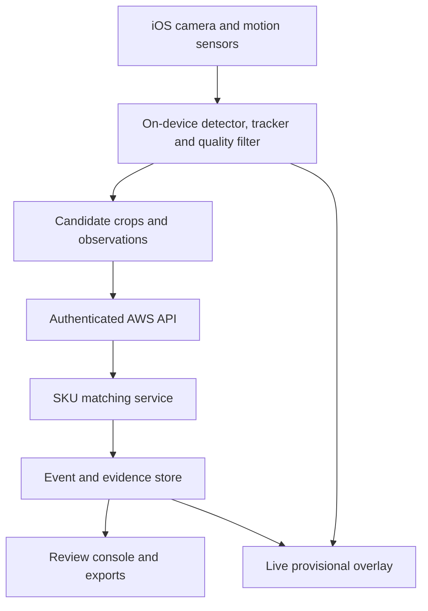

# Build brief: camera-based inventory on AWS

Copy this document into an AWS-connected software builder. Build a working, deployable MVP, not a UI-only mockup. Before provisioning, show the operator the chosen AWS account, region, resources, expected recurring cost drivers, and the deployment command. Require an explicit deploy action in the builder. Do not claim visual counts are exhaustive when products are hidden.

## Product and scope

Build an iOS-first smartphone app and web review console for counting **visible physical packages on real shelves** during a guided walk-through. Support prerecorded video import using the same processing pipeline. Start with one organization, one site, 50–200 known SKUs, one phone, and one scan session at a time. Multiple users, multi-site and ERP export should be supported by the data model; concurrent cross-camera deduplication is phase two. A scan is an observation of visible shelf facings, not a full stock-on-hand figure. Hidden or rear units require an explicit manual count or separate data source.

Default assumptions to configure rather than hardcode: AWS region chosen by owner (prefer a Canadian region if residency is required); 720p at 15–30 fps camera capture; inference on selected frames rather than every frame; occasional connectivity; labels or barcodes are helpful but may be absent. The builder must ask for the AWS account and region, SKU catalog, sample photos/videos, and target phone before live deployment or model validation.

## Acceptance criteria

1. Import a catalog CSV (`sku,name,barcode,category`) and upload at least 5–20 varied reference images per SKU, including realistic shelf photos and different orientations. Reject duplicate SKU IDs and conflicting barcodes; version the catalog and model.
2. Start a scan with site, zone, shelf and operator. Display the live camera, provisional boxes/labels, confirmed count by SKU, unknown items, capture quality prompts, and a clear end-scan action.
3. Assign a local track ID to each visible package. Do not count each video frame. Require sustained evidence from multiple sharp frames or a valid barcode before confirming a SKU; expose confidence and evidence images.
4. Deduplicate an object when it disappears and reappears in the same shelf zone using overlap, visual embedding, position and camera motion. If identity is uncertain, send to review rather than incrementing silently. Re-scanning a zone should compare against its existing scan records.
5. Save a per-object observation and an immutable count event. The summary is a projection of accepted events; retries must not increment the count twice. Manual corrections preserve who, when, reason and original evidence.
6. Work offline for an active session, queue events locally, and synchronize idempotently after reconnection. A restart must recover the session without recounting previously confirmed objects.
7. Provide a review console with video/evidence thumbnails, unknown and low-confidence queue, editable SKU assignments, count adjustment with reason, scan comparison and CSV export. Only reviewed scans may be marked final.
8. Include a prerecorded-video replay test set with ground-truth object IDs, SKU IDs and counts. Report SKU precision/recall, counting absolute error, duplicate rate, unknown rate, latency and performance by lighting/occlusion. Do not advertise a universal accuracy percentage before measuring it.

## Recommended system design

On device, implement camera capture, focus/blur/occlusion checks, detector and multi-object tracker. Use a replaceable model interface: start with a benchmarked small object detector, ByteTrack-style association or equivalent, and an embedding model for re-identification. Train or fine-tune using actual catalog shelf footage; do not assume a generic model distinguishes similar SKUs. Use Core ML on iOS if it meets device benchmarks. Record camera intrinsics, motion/pose and depth where available. An ordinary camera is sufficient for the MVP, but spatial deduplication is an evaluated feature rather than a guarantee. Provide an Android implementation later behind the same API.

For each track, select a few sharp, nonredundant crops, check barcode locally if visible, combine barcode/OCR, embedding retrieval and SKU reranking, and aggregate evidence across frames. Decision states: `PROVISIONAL`, `CONFIRMED`, `UNKNOWN`, `REVIEW_REQUIRED`. A barcode lookup must match a known catalog barcode; OCR is a supporting signal, not a unique key. Keep thresholds in versioned configuration calibrated on held-out footage. Emit at most one confirmation per physical-object ID; if a provisional match changes, amend the observation and event projection with an auditable reversal/correction rather than silently adding another item.

Cloud service mapping:

| Need | AWS implementation |
| --- | --- |
| Identity | Amazon Cognito user pool; organization/site claims checked server-side |
| HTTPS API | API Gateway HTTP API plus Lambda for catalog, sessions, event ingestion and review |
| Catalog and scan records | DynamoDB, with explicit tenant/site keys, conditional writes and on-demand capacity to start |
| Images and optional short evidence clips | Private S3 buckets, presigned upload URLs, lifecycle expiration, encryption and blocked public access |
| Async recognition | SQS queue feeding an ECS service on EC2 GPU capacity **only if benchmarks justify GPU**; begin with CPU service or on-device retrieval when adequate |
| Container images | ECR |
| Web console | S3 + CloudFront static frontend, or an equivalent AWS-hosted frontend |
| Observability | CloudWatch structured logs, alarms, dashboards, tracing and dead-letter queue |
| Secrets and keys | Secrets Manager where needed, KMS-managed encryption, least-privilege IAM |
| Infrastructure | AWS CDK v2 in TypeScript, checked into source control, with `dev` and `prod` configurations |

Do not use Lambda for long-running video decoding or rely on generic Rekognition labels as the SKU classifier. For optional continuous cloud video, separately prototype Kinesis Video Streams/WebRTC and an always-running consumer; measure end-to-end latency, bandwidth and cost before enabling it. The MVP should transfer selected crops/events and optional short clips, not an unconditional full-resolution stream. GPU workers on ECS need EC2 GPU-backed instances and GPU task configuration; do not assume Fargate GPU support.

## Data contracts and idempotency

Tables can be separate DynamoDB tables for ease of implementation. Every record carries `orgId`, timestamps and schema version. Suggested keys:

- `Products`: PK `ORG#<orgId>`, SK `SKU#<sku>`; name, barcode(s), catalogVersion, reference image keys, active flag.
- `Sessions`: PK `ORG#<orgId>`, SK `SESSION#<sessionId>`; siteId, zone/shelf, deviceId, operatorId, catalogVersion, modelVersion, state (`ACTIVE|REVIEW|FINAL`), start/end timestamps.
- `Observations`: PK `SESSION#<sessionId>`, SK `OBJECT#<objectId>`; track IDs, shelf position/optional pose, candidate SKUs/scores, evidence keys, state and revision. `objectId` is stable across offline retries in one session.
- `CountEvents`: PK `SESSION#<sessionId>`, SK `EVENT#<eventId>`; objectId, event type (`CONFIRM|REVERSE|REASSIGN|MANUAL_ADJUST`), SKU, quantity delta, actor, reason, evidence and timestamp. Require unique `eventId` via conditional put; use a DynamoDB transaction when an event and observation revision must change together. Derive counts by replay or a transactionally updated projection.
- `ReviewTasks`: PK `SESSION#<sessionId>`, SK `TASK#<taskId>`; reason, status and reviewer decision.

Never use an image filename or frame number as a physical-object ID. Keep a session-local object registry and a zone revisit registry. Across different sessions, treat counts as separate snapshots; do not sum them as inventory stock. Include optimistic revision checks for concurrent review edits.

Proposed authenticated endpoints (OpenAPI 3 document required): `POST /catalog/import`, `GET /catalog/products`, `POST /sessions`, `GET /sessions/{id}`, `POST /sessions/{id}/observations:batch`, `POST /sessions/{id}/events:batch`, `POST /sessions/{id}/evidence-upload-url`, `GET /sessions/{id}/summary`, `GET /sessions/{id}/review-tasks`, `POST /sessions/{id}/review-decisions`, `POST /sessions/{id}/finalize`, `GET /sessions/{id}/export`. Batch requests carry `clientRequestId`, `deviceId`, sequence and model/catalog versions. Return per-item accepted/duplicate/rejected status; validate ownership and enforce limits and content type.

## Capture and counting algorithm

1. Operator selects a specific shelf/zone and scans slowly left-to-right with deliberate overlap; app prompts for blur, glare and missed area. Save a zone boundary/scan segment.
2. Detect package instances on selected frames; link boxes using motion and appearance into local tracks. Keep track history across brief occlusion and camera turns.
3. For each track, select sharp crops with distinct views. Extract barcode if present; otherwise compare embeddings against catalog references and rerank likely SKUs using crop, packaging text and colors. Calibrate confidence using held-out examples.
4. Link tracks to the same physical-object ID using camera pose/depth if available, image feature geometry, embedding similarity and shelf position. Avoid merging adjacent identical boxes; use distinct positions and temporal evidence. Mark uncertain links for review.
5. Confirm only when both physical uniqueness and SKU evidence pass separate thresholds. Allow `UNKNOWN` when a product is visible but SKU is unresolved. Count each confirmed object once, pending a reviewable audit trail.
6. On revisits, reconcile against saved positions and evidence for that zone. If pose quality is poor, ask operator to avoid or manually reconcile overlapping scan areas.
7. At end, display coverage gaps and unknowns; reviewer resolves them and finalizes a snapshot. Export includes visible count, unknown count, coverage status and timestamp, never an unqualified stock-on-hand claim.

## Infrastructure and delivery instructions to builder

Create a repository with `/infra` CDK stacks, `/api`, `/worker`, `/mobile`, `/web`, `/models`, `/tests`, `/docs`, CI and a sample catalog. Parameterize AWS account, region, environment name, domain, retention days, max daily spend alert, allowed model version and worker desired count. Start dev with worker desired count 0 if on-device matching suffices. Use separate dev/prod stacks, private buckets, encryption in transit and at rest, appropriate S3 CORS, deletion protection for production data, and explicit retention/removal policies. Set a budget alert and CloudWatch alarms for API errors, queue age, worker failure and unexpected spend. IAM access must be scoped by resource and role; mobile never receives permanent AWS keys. Emit deploy outputs: API base URL, Cognito client configuration, web URL and evidence bucket name (do not output secrets).

Implement in phases, each with a runnable demonstration and acceptance report:

- Phase 1: CDK infrastructure, auth, catalog import, session/event APIs, immutable counting ledger, review UI and offline sync using **synthetic observations**. Deploy dev and show full create/scan/review/export flow.
- Phase 2: Real iOS video capture, detector, tracker, barcode path and recorded-video replay. Measure device fps, battery and upload volume.
- Phase 3: Catalog-based SKU identification, calibrated unknown handling, evidence aggregation and re-identification on real shelf data.
- Phase 4: Coverage and revisit checks, human review, security/operations testing and pilot on the owner's shelves.
- Phase 5 (conditional): Add GPU/cloud stream or Android only if measured requirements demand it.

Provide automated tests for event idempotency, correction/replay, offline retry, tenant isolation, auth, duplicate view, adjacent identical products, occlusion and wrong/unknown SKU. Supply infrastructure smoke tests and a teardown procedure for dev that preserves prod data. In pilot, define ground truth by manually counting every *visible* package in the scanned zone and compare the final reviewed snapshot. Report confidence intervals over multiple aisles and sessions. A builder must not declare the product production ready from synthetic data alone.

## Cost and operational controls

Produce an AWS Pricing Calculator estimate for the selected region and stated assumptions before deployment: number of active devices, minutes scanned per day, selected crops per minute, average crop/clip sizes, API requests, S3 retention, DynamoDB operations, data transfer, and always-on GPU hours if enabled. Show a low-usage and peak scenario and separate fixed from per-scan cost. Set quotas/alerts; avoid leaving GPU instances running without demand. Actual prices and available instance types must be checked for the chosen region at deployment.

## Builder response required before deploying

Return (1) architecture and tradeoffs, (2) repository tree, (3) CDK resource plan and IAM permissions, (4) API schema and database keys, (5) model/data collection plan and measurable acceptance thresholds, (6) exact commands to synth/deploy/test/tear down dev, (7) cost estimate with assumptions, and (8) open decisions requiring owner input. Then implement phases in order, reporting deployed resource identifiers and test results. Do not create chargeable AWS resources until the owner invokes deploy in the builder.

## AWS reference documentation

- [ECS GPU task definitions](https://docs.aws.amazon.com/AmazonECS/latest/developerguide/ecs-gpu.html)
- [Kinesis Video Streams with WebRTC](https://docs.aws.amazon.com/kinesisvideostreams-webrtc-dg/latest/devguide/what-is-kvswebrtc.html)
- [DynamoDB conditional writes](https://docs.aws.amazon.com/amazondynamodb/latest/developerguide/Expressions.ConditionExpressions.html)
- [AWS CDK guide](https://docs.aws.amazon.com/cdk/v2/guide/)
